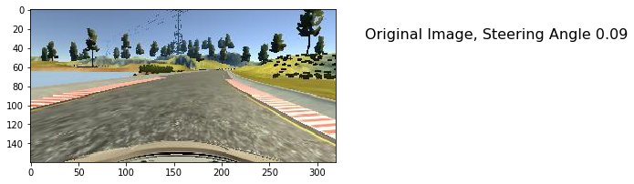
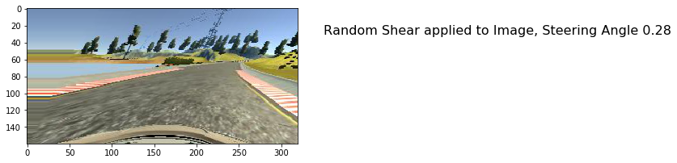
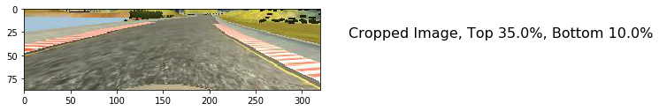
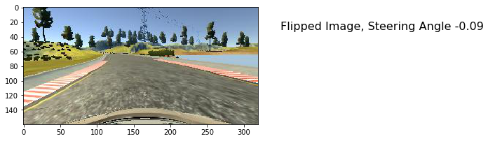
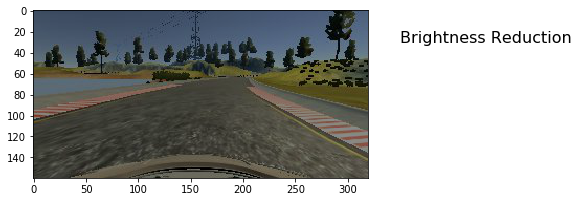

# P3-behavioral-cloning

## Behavioral Cloning 
  Training our car driving model based on cloning the behavior from existing car driving camera feed. 
  This is part of Udacity Self-driving Car Engineer Nanodegree
  
### Steps taken
  Training consisted of two steps, both very important. 
  Driving Car -- First, is to drive a car and capturing videos that will be used for our model training. 
  Capturing involves taking a snapshot image and recording the steering angle that the human car driver
  provided while driving. This is the "labeled" input which we can use as part of supervisor learning. 
  Udacity provided a simulator which can be used instead of actually driving. While the video capture also 
  consists of other parameters such as throttle (speed control), we wont be using it for this exercise.
  
### Model learning -- we feed the supervised labelled input, which is a series of {image, steering angle}
  to our model training algorithm. This is where we can evaluate various deep learning models and apply
  them to our usecase. Choosing from Imagenet, VGG, and transfer learning are all valid choices. We
  settled on using Nvidia's End to End Learning for Self-Driving Cars, as our reference model, and 
  tinkered with it only so slightly. 
  
  https://images.nvidia.com/content/tegra/automotive/images/2016/solutions/pdf/end-to-end-dl-using-px.pdf
  
  Our model, with shapes, is as follows: 

 

  Learning_rate of 1e-4 was found to be optimal, even though the number of epochs of 8, seems sufficient for
  this training. Adam optimizer was chosen for this experiment. 
  
  We tried to reduce overfitting and regularize by using dropout, but the final model did not include it
  as it reduced the overall loss rate, as well as it did not pass the track1 and got stuck several places. 
  

### Model training vagaries
  Since we'e limited data during training, and actual conditions during test drive may vary, we apply a series
  of image processing on the individual images, and create tons of augmented data and train on it. Series of
  image processing, on a representative original image, such as this,

 

  Processing each function happens in randomized fashion, involves image shearing 

 

    image cropping - so our training only happens on relevant image

 

    flipping image - Much of driving might involve only left turns or right turns, so horizontal flipping the 
    image and changing steering angle accordingly might provide us more augmented data

 

    brightness reduction - helps with shadow conditions and low-light driving usecases

 

    image normalization & resizing - so that model parameters are applicable to other situations as well

 

    
### Video results
  Here are our results. Throttle was set to 0.3, and it also proved a stable scenario. Both the tracks were
  successfully driven by our model learnt only on data from Track 1. 
  Learning from tricky situations was required to get out of trouble. We generated lots of simulator training
  but that wasnt found very effective, due to observations listed belows.
  Combination of learning rate, as well as image augmentation techniques helped to train the model for 
  unexpected siutations on track 2. 
  
  
### Observations
  Training data, on Udacity simulator, proved very hard to be used. Ended up learning from provided data.
  Use of "force" of the mouse instead of "distance" - is an in-effective choice of simulator, imo. 
  
  Hyper-parameter optimization, choosing (or eliminating use of) dropouts, number of epochs, were all 
  regular techniques for any deep-learning training. 
  
  
    
